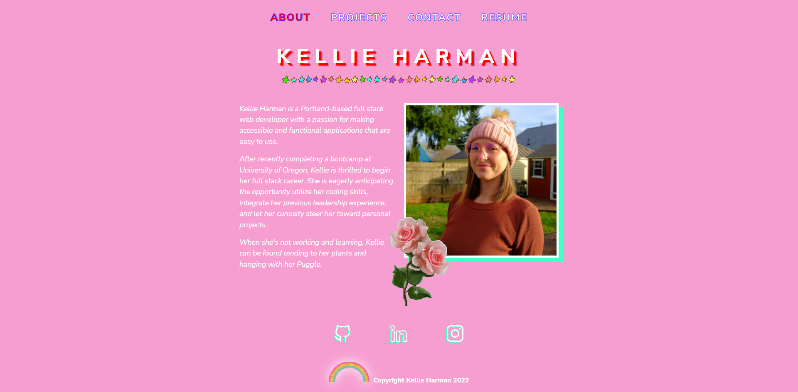

# Harman React Portfolio
  
  ### Description
  A portfolio for a new web developer created with React.  
  ### Table of Contents
  * [Usage](#usage)
  * [Links](#links)
  * [Questions](#questions)
  * [License](#license)
  * [Screenshot](#screenshot)
  ### Usage
  Check out my portfolio featuring some of my most recent projects. You can get in touch with me using the contact form or download my resume. 
  ### Links
  You can check out the deployed app [here](https://knharman.github.io/harman-react-portfolio/)
  ### Questions
  If you have additional questions, you can contact me here: knharman@gmail.com
  Check out my GitHub: [knharman](https://github.com/knharman)
  ### License
  Licensed under [MIT](https://choosealicense.com/licenses/mit/) 2022
  ### Screenshot
  